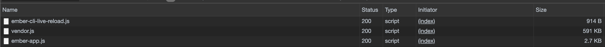

# Speed

# Improving on build size and making your builds faster

### Minification, Gzip or Brotli compression and Fingerprinting.

Make sure your builds are done with `production` flag turned on.

    ember b -p
    # or
    ember build --prod
    # or
    ember build --environment=production

First and foremost, like every asset that the app’s index.html consumes, need to be minified and gzipp’ed. In Ember, your app could be configured to do so using the following lines of code:

    // ember-cli-build.js
    
    module.exports = function(defaults) {
        // ...
        const isProduction = EmberApp.env() === 'production';
        
        let app = new EmberApp(defaults, {
          fingerprint: {
            enabled: isProduction // Enabled in production by default until you override.
          },
          minifyJS: {
            enabled: isProduction // Enabled in production by default until you override.
          },
          minifyCSS: {
            enabled: isProduction // Enabled in production by default until you override.
          }
        });
    
        // ...
    
        return app.toTree();
    };

You don’t have to generally worry about this configuration as Ember takes care of it for you for prod builds.

## Analyze bundle size and optimize asset size

`ember-cli-bundle-analyzer` is an Ember CLI addon that analyzes the size and contents of your Ember apps. To try it out check [https://github.com/kaliber5/ember-cli-bundle-analyzer](https://github.com/kaliber5/ember-cli-bundle-analyzer)

It helps you to

- Analyze which individual modules make it into your final bundle
- Find out how big each contained module is, including the raw source, minified and gzipped sizes
- Find modules that got there by mistake; and
- Optimize your bundle size

Install this addon using the following command:

    ember install ember-cli-bundle-analyzer

Once done, navigate to [http://localhost:4200/_analyze](http://localhost:4200/_analyz) in your web browser to analyze the output.

## Using dependencies that you only need on boot.

Generally, any npm package that you add, when you use the traditional approach (during the < Ember-2.12 days) of `app.import('node_modules/package/src.js');` in your ember-cli-build.js contributes to increased vendor.js file size. 

For example, if you would want your Ember app to have 3rd party packages like lodash-es, your app needs the code while using some of the lodash methods. Using `[ember-auto-import](https://github.com/ef4/ember-auto-import)` you can dynamically import these dependencies code at run time.

Before we get go in depth of this process, let's see our `vendor.js` of the current sample app:

It is at 591Kb

To get started with ember-auto-import:

    npm install --save-dev lodash-es # Adds lodash-es for example to your dependencies
    
    ember install ember-auto-import

And go ahead and say in your components or controllers or any parts of your code.

    import { capitalize } from 'lodash-es';

Wait, vendor.js just got increased by ~200Kb while doing the above steps 😱

Doing just this, shot the file size to 765Kb!

Didn't we say we wanted to reduce the vendor.js size? Yes, for which you need to do a little bit more:

### Welcome Dynamic Import!

Dynamic import is currently a Stage 3 ECMA feature, so to use it there are a few extra setup steps:

1. Install babel-eslint

        npm install --save-dev babel-eslint

2. In your .eslintrc.js file, add

        parser: 'babel-eslint'

3. In your ember-cli-build.js file, enable the babel plugin provided by ember-auto-import:

        let app = new EmberApp(defaults, {
          babel: {
            plugins: [ require.resolve('ember-auto-import/babel-plugin') ]
          }
        });

4. Now all you need to do is, just dynamically import the dependency. For example:

        import Route from '@ember/routing/route';
        
        export default class SampleInnerRoute extends Route {
          model() { // This will be render-blocking, you can also move this to your controller' or component' JS file
            return import('lodash-es').then(({ capitalize }) => {
              return capitalize('Sample App');
            });
          }
        }

    

    Moving to dynamic imports brought it back down to 592Kb.

    For more on this addon, [read here.](https://github.com/ef4/ember-auto-import)

## Measure Rendering Performance

Ember's ecosystem comes with a Google Chrome Extension and Mozilla Firefox Addon called "Ember Inspector". One of the important features of the Ember Inspector is "Render Performance". To read more about measuring rendering performance of your Ember apps, [check it out here](https://guides.emberjs.com/release/ember-inspector/render-performance/).
